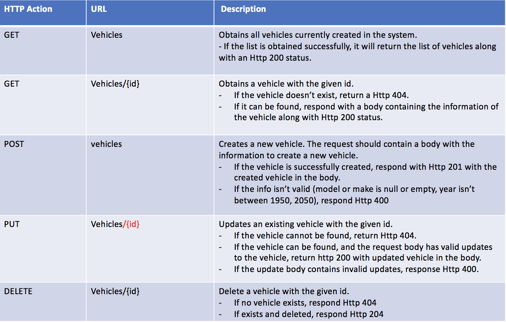
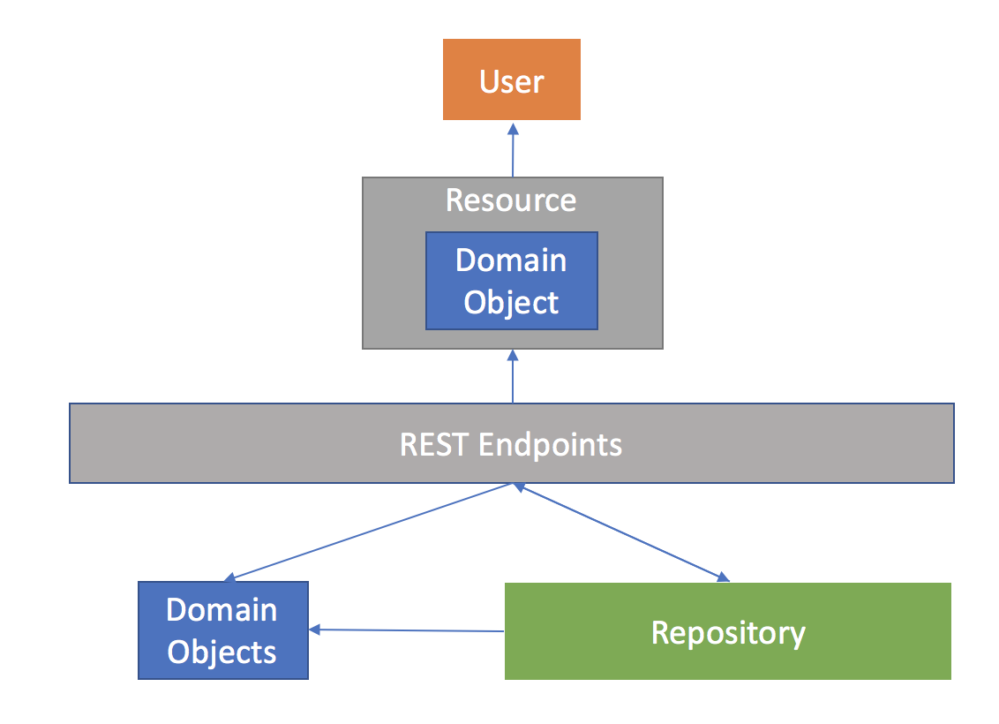
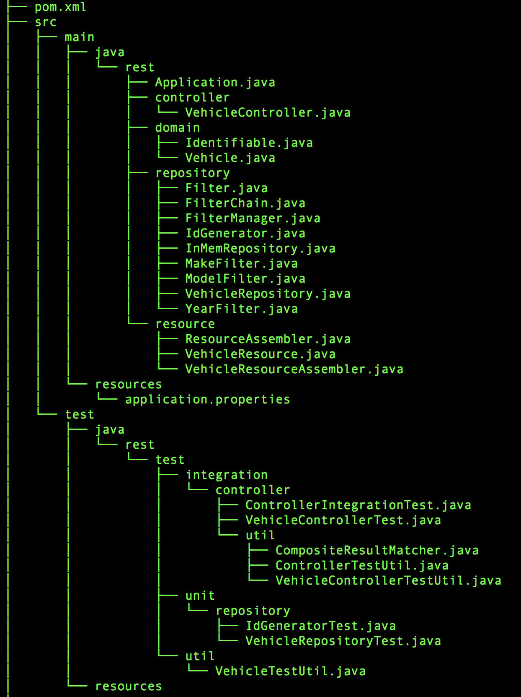

### REST API with Spring MVC & Spring Boot
##### Tools
* Spring MVC
* SpringBoot
* Jackson
* Spring HATEOS
* JUnit
* Apache Maven


##### REST API Basic functions


##### System Architecture


##### Optional
- Filtering (filter vehicles with vehicle features)
  * Used Filter Design Pattern
- Invalid Input check

##### Project Structure


##### To Run it
Execute the following command in the directory containting the pom.xml file<br>
```
$ mvn spring-boot:run
```
Then you can connect to http://localhost:8090/vehicles to play with it!
Note: 8090 port is set in the src/resources/application.properties
